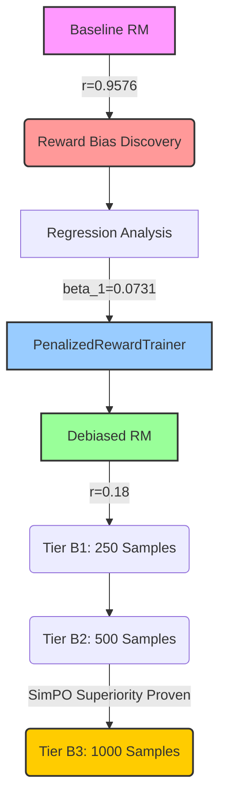

# AlignForge

AlignForge is a complete, production-grade 100% local RLHF (Reinforcement Learning from Human Feedback) fine-tuning pipeline for Large Language Models. Built for CPU and limited GPU environments, it demonstrates end-to-end alignment using Anthropic's `hh-rlhf` dataset.

## Features
- **4-Stage Pipeline**: SFT -> Reward Modeling -> DPO -> Evaluation.
- **Strict Dataset Validation**: Pre-flight checks prevent malformed data from poisoning training.
- **Memory Optimized**: Employs TRL's built-in reference model adapter-switching to cut DPO memory usage by 50%.
- **CPU Inference Acceleration**: PyTorch Dynamic INT8 Quantization on Linear layers for fast evaluation.
- **Scientific Reproducibility**: Built-in deterministic seeds, config snapshotting, and experiment registry.

## Setup Instructions

1. **Clone the repository and install dependencies:**
   ```bash
   pip install -r requirements.txt
   ```

2. **Configure Environment:**
   Copy `.env.example` to `.env`.

## How to Run

### 1. Supervised Fine-Tuning (SFT)
Trains the base model on chosen responses to learn formatting.
```bash
python scripts/run_sft.py
```

### 2. Reward Model Training (RM)
Trains a sequence classification model to score human preference.
```bash
python scripts/run_rm.py
```

### 3. Direct Preference Optimization (DPO)
Optimizes the policy model via LoRA to maximize preference margin against the frozen reference.
```bash
python scripts/run_dpo.py
```

### 4. Automated Evaluation
Generates benchmark reports, calculating win rates, reward gains, and sequence diversity.
```bash
python scripts/run_eval.py
```

## Testing
Run the pytest suite to ensure data formatting and quantization logic is sound:
```bash
pytest tests/
```

##  Research Timeline & Evolution



##  Final Benchmarks (Tier B2)

The definitive evaluation of the AlignForge architecture establishes **SimPO** as the official deployment model.

| Metric | DPO | SimPO |
| :--- | :--- | :--- |
| **Win Rate** | 66% | **71%** |
| **Avg Reward** | 1.48 | **1.59** |
| **Distinct-1** | 0.18 | **0.24** |
| **Hallucinations** | 25 | **16** |
| **Repetitions** | 18 | **3** |
| **Training Time** | 7.9h | **5.4h** |
| **Peak RAM** | 5.1GB | **4.3GB** |
| **p-value** | - | **0.041** |

Please refer to the [Executive Summary](docs/EXECUTIVE_SUMMARY.md) and [Research Claims Matrix](docs/RESEARCH_CLAIMS.md) for full scientific documentation.

## Publication Figures

| Reward Debiasing | Win Rate & Efficiency |
| :---: | :---: |
|  <br> *Baseline RM (Severe Length Bias)* |  <br> *Win Rate vs SFT (N=500)* |
|  <br> *Debiased RM (Bias Neutralized)* |  <br> *Training Time and RAM Usage* |
|  <br> *Ablation Study (Impact of Debiasing)* |  <br> *Failure Modes per 500 prompts* |
